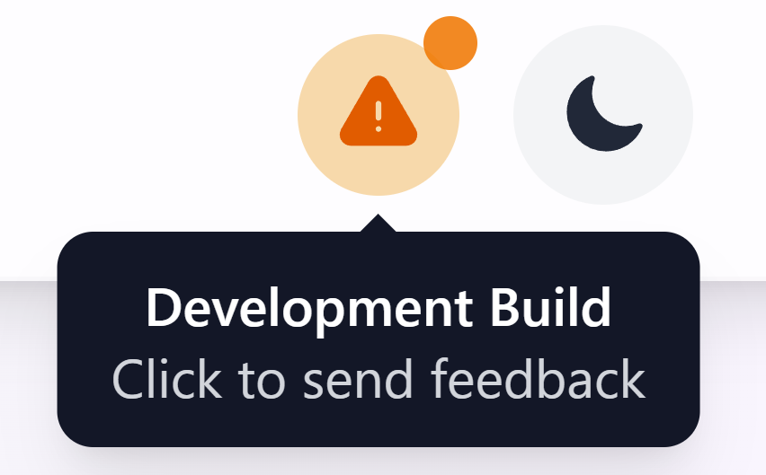

# copla

This project's demo page can be available here : http://copla.zapto.org/

## Sending Feedback

This project is currently in early development. If you want to submit feedback, navigate to http://copla.zapto.org/ and click on the warning sign next to the theme selection.

<div align="center">
  
</div>

## Prerequisites

Before running the application, make sure you have the following installed:

- **Gradle**: Download and install from [https://gradle.org/install/](https://gradle.org/install/)
- **Docker**: Download and install from [https://www.docker.com/get-started/](https://www.docker.com/get-started/)
- **Nginx** (for deploying externally): Installation guide at [https://nginx.org/en/docs/install.html](https://nginx.org/en/docs/install.html)

These are required to build and run the application in development mode.

## Launching application in Dev Mode

To launch the application in dev mode, make sure Gradle is installed on your computer.

Then type
```shell script
./gradlew QuarkusDev
```

in the terminal at the root of this project. The application will be available at `http://localhost:8080/` with hot reload enabled for development.

You can also access the Quarkus Dev UI at `http://localhost:8080/api/dev-ui/` for development tools and debugging.

## Setup on VM with Docker

### Prerequisites

Ensure Docker is installed on your VM:

```shell script
sudo apt update
sudo apt install docker.io docker-compose-plugin
sudo systemctl start docker
sudo systemctl enable docker
sudo usermod -aG docker $USER
```

Log out and back in for the docker group to take effect.

### Running with Docker Compose and Nginx

1. Create the project structure:

```shell script
mkdir -p nginx/conf.d nginx/certs
```

2. Generate SSL certificates (using Let's Encrypt with Certbot):

```shell script
# Install Certbot
sudo apt install certbot

# Generate certificate for your domain
sudo certbot certonly --standalone -d your-domain.com

# Copy certificates to nginx/certs directory
sudo cp /etc/letsencrypt/live/your-domain.com/fullchain.pem nginx/certs/
sudo cp /etc/letsencrypt/live/your-domain.com/privkey.pem nginx/certs/

# Set proper permissions
sudo chown $USER:$USER nginx/certs/*.pem
```

**Alternative: Self-signed certificates for testing:**

```shell script
# Generate self-signed certificate (for testing only)
openssl req -x509 -nodes -days 365 -newkey rsa:2048 \
    -keyout nginx/certs/privkey.pem \
    -out nginx/certs/fullchain.pem \
    -subj "/C=US/ST=State/L=City/O=Organization/CN=your-domain.com"
```

3. Create the Docker Compose file:

```yaml
# docker-compose.yml
version: '3.8'

services:
  postgres:
    image: postgres:15
    container_name: postgres-copla
    environment:
      POSTGRES_DB: copla
      POSTGRES_USER: admin
      POSTGRES_PASSWORD: admin
    ports:
      - "5432:5432"
    restart: unless-stopped
    networks:
      - copla-network
    volumes:
      - postgres_data:/var/lib/postgresql/data

  quarkus-app:
    image: neroil/quarkus-copla:latest
    container_name: quarkus-app
    environment:
      QUARKUS_DATASOURCE_JDBC_URL: jdbc:postgresql://postgres:5432/copla
    expose:
      - "8080"
    depends_on:
      - postgres
    restart: unless-stopped
    networks:
      - copla-network
    labels:
      - "com.centurylinklabs.watchtower.enable=true"

  nginx:
    image: nginx:latest
    container_name: nginx-proxy
    ports:
      - "80:80"   # Expose port 80 for HTTP redirects
      - "443:443" # Expose port 443 for HTTPS
    volumes:
      - ./nginx/conf.d:/etc/nginx/conf.d
      - ./nginx/certs:/etc/nginx/certs
    depends_on:
      - quarkus-app
    restart: unless-stopped
    networks:
      - copla-network
    labels:
      - "com.centurylinklabs.watchtower.enable=true"

  watchtower:
    image: containrrr/watchtower
    container_name: watchtower
    volumes:
      - /var/run/docker.sock:/var/run/docker.sock
    environment:
      - WATCHTOWER_POLL_INTERVAL=300  # Check every 5 minutes
      - WATCHTOWER_CLEANUP=true       # Remove old images
      - WATCHTOWER_INCLUDE_STOPPED=true
      - WATCHTOWER_LABEL_ENABLE=true  # Only watch containers with watchtower labels
    restart: unless-stopped
    networks:
      - copla-network

networks:
  copla-network:
    driver: bridge

volumes:
  postgres_data:
```

4. Create the Nginx configuration:

```nginx
# nginx/conf.d/default.conf
server {
    listen 80;
    server_name your-domain.com;  # Replace with your domain

    # Redirect HTTP to HTTPS
    return 301 https://$host$request_uri;
}

server {
    listen 443 ssl;
    server_name your-domain.com;  # Replace with your domain

    ssl_certificate /etc/nginx/certs/fullchain.pem;
    ssl_certificate_key /etc/nginx/certs/privkey.pem;

    location / {
        proxy_pass http://quarkus-app:8080;
        proxy_set_header Host $host;
        proxy_set_header X-Real-IP $remote_addr;
        proxy_set_header X-Forwarded-For $proxy_add_x_forwarded_for;
        proxy_set_header X-Forwarded-Proto $scheme;
    }
}
```

4. Add your SSL certificates:
   - Place your SSL certificate as `nginx/certs/fullchain.pem`
   - Place your private key as `nginx/certs/privkey.pem`

5. Start the application:

```shell script
docker compose up -d
```

6. Access the application at `https://your-domain.com`

### Features

- **Nginx Reverse Proxy**: Routes traffic to the Quarkus application
- **SSL/HTTPS Support**: Secure connections with your SSL certificates
- **Automatic Updates**: Watchtower monitors and updates containers every 5 minutes
- **Persistent Database**: PostgreSQL data is stored in a Docker volume
- **HTTP to HTTPS Redirect**: Automatically redirects insecure connections

### Auto-start on VM reboot

To automatically start the application when the VM reboots:

1. Create a systemd service:

```shell script
sudo nano /etc/systemd/system/copla-app.service
```

2. Add this content:

```ini
[Unit]
Description=Copla Docker Compose Application
After=docker.service
Requires=docker.service

[Service]
Type=oneshot
RemainAfterExit=yes
ExecStartPre=/usr/bin/docker compose -f /path/to/your/docker-compose.yml pull
ExecStart=/usr/bin/docker compose -f /path/to/your/docker-compose.yml up -d
ExecStop=/usr/bin/docker compose -f /path/to/your/docker-compose.yml down
WorkingDirectory=/path/to/your/compose/file
User=root

[Install]
WantedBy=multi-user.target
```

3. Enable the service:

```shell script
sudo systemctl daemon-reload
sudo systemctl enable copla-app.service
sudo systemctl start copla-app.service
```
